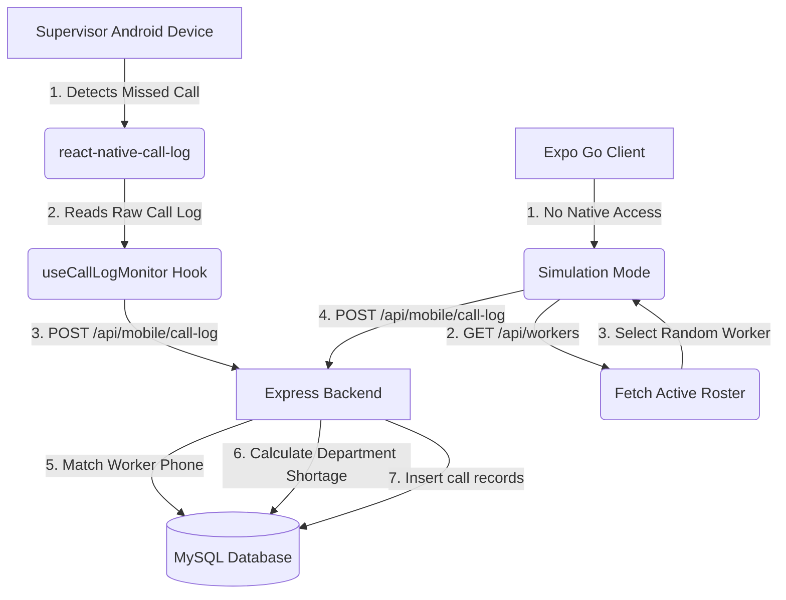

# Auto Missed Call Monitor Documentation

This document outlines the architecture, data flow, database schema, and runtime behaviors of the **Auto Missed Call Monitor** feature in the **CLE Call AP** system.

---

## 1. Overview
The **Auto Missed Call Monitor** is an administrative feature designed to run on a supervisor/admin's mobile device. It automatically detects incoming missed calls and registers them on the backend server for reference, department shortage tracking, and auditing.

Key characteristics:
* **Admin-Only**: The monitor widget and logging screens are only rendered and executed for users logged in with the `Admin` role.
* **Decoupled Architecture**: Captured missed calls are logged purely as call records for reference and shortage calculation. They **do not** automatically alter the core `attendance` table, ensuring manual supervisor control remains the source of truth for shift attendance.
* **Dual Execution Modes**: Falls back gracefully to simulation mode when running under non-native clients like Expo Go.

---

## 2. System Architecture



### Mobile Frontend Components
1. **[useCallLogMonitor](file:///d:/CLE_call_ap/mobile/hooks/useCallLogMonitor.js)**: 
   A custom React hook that coordinates background polling, permissions, active worker fetching, simulation mode, and postings.
2. **[AutoCallLogStatus](file:///d:/CLE_call_ap/mobile/components/AutoCallLogStatus.js)**:
   A dashboard widget visible to Admins displaying scan status (Live vs. Simulator), last scan timestamps, a list of auto-detected calls this session, and a "Scan Now" manual trigger.
3. **[MissedCallScreen](file:///d:/CLE_call_ap/mobile/components/MissedCallScreen.js)**:
   A manual entry form allowing supervisors to type in a caller's number, select a date and time, add notes, and submit it directly to the same backend pipeline.

---

## 3. Runtime Modes

### A. Live / Native Mode (Android Custom Dev Build)
* Runs when the app is built natively (`npx expo run:android`).
* Utilizes `react-native-call-log` to read the device's telephony registry.
* Requests `android.permission.READ_CALL_LOG` permissions.
* Polls every 30 seconds, filtering logs to find **today's missed or rejected calls** since midnight, matching them against processed call signatures (`phone_timestamp`) to avoid duplicates.

### B. Simulation Mode (Expo Go Client)
* Automatically activates if `react-native-call-log` is unavailable.
* Periodically fetches active workers from the backend API `/api/workers`.
* Every 30 seconds, it picks a random active worker from the roster and logs a mock missed call with `notes: "Simulated missed call (Expo Go Mode)."` to ensure developers can test the end-to-end telemetry pipeline without native hardware limitations.

---

## 4. Backend Processing Flow

When a call payload is sent to `POST /api/mobile/call-log`:
1. **Sanitize Phone**: Cleans the input phone number to extract the last 10 digits (`cleanPhone`).
2. **Lookup Worker**: Query all `Active` workers in the database to see if `cleanPhone` matches a registered worker.
3. **Check Duplicates**: Inspects `mobile_call_logs` to check if a call from this caller number (or matched worker ID) has already been captured for the specified date.
4. **Calculate Shortage**: 
   * Retrieves the worker's department ID.
   * Fetches the department's configured `min_workers`.
   * Queries the `attendance` table for the number of workers in that department who are already marked `Coming` or `Present` for today.
   * Computes: `shortage_count = Math.max(0, min_workers - confirmed_today)`.
5. **Database Inserts**:
   * Logs a record in `raw_call_logs` (audit trail of all incoming caller signals).
   * Logs a record in `mobile_call_logs` containing the caller number, matched worker ID, time, date, shortage count, and admin notes.
6. **Response**: Returns worker matching status, worker name, department, and shortage details.

---

## 5. Database Schema

### `mobile_call_logs`
Stores the sanitized and matched call logs captured from the mobile client.
```sql
CREATE TABLE IF NOT EXISTS mobile_call_logs (
  id INT AUTO_INCREMENT PRIMARY KEY,
  caller_number VARCHAR(30) NOT NULL,
  call_date DATE NOT NULL,
  call_time VARCHAR(10) NOT NULL,
  submitted_by VARCHAR(50),
  matched_worker_id INT,
  shortage_count INT DEFAULT 0,
  notes TEXT,
  created_at DATETIME DEFAULT CURRENT_TIMESTAMP,
  FOREIGN KEY (matched_worker_id) REFERENCES workers(id) ON DELETE SET NULL
);
```

### `raw_call_logs`
Audit log storing all raw call data received by the server.
```sql
CREATE TABLE IF NOT EXISTS raw_call_logs (
  id INT AUTO_INCREMENT PRIMARY KEY,
  caller_number VARCHAR(30) NOT NULL,
  call_date DATE NOT NULL,
  call_time VARCHAR(10) NOT NULL,
  submitted_by VARCHAR(50),
  created_at DATETIME DEFAULT CURRENT_TIMESTAMP
);
```

---

## 6. API Endpoints Reference

### 1. Register Call Log
* **URL**: `/api/mobile/call-log`
* **Method**: `POST`
* **Body**:
  ```json
  {
    "caller_number": "8754704105",
    "call_date": "2026-06-02",
    "call_time": "17:45",
    "submitted_by": "admin",
    "notes": "Spoke to worker"
  }
  ```
* **Success Response (Matched Worker)**:
  ```json
  {
    "success": true,
    "id": 117,
    "matched": true,
    "worker_name": "aravindh",
    "department_name": "Maintenance",
    "shortage_count": 0
  }
  ```

### 2. Retrieve Call Logs
* **URL**: `/api/mobile/call-log`
* **Method**: `GET`
* **Query Params**: `limit` (default 100), `date` (format YYYY-MM-DD, optional)
* **Response**: An array of call logs joined with worker and department names.

### 3. Retrieve Calls Shortage Summary
* **URL**: `/api/mobile/shortage-by-number`
* **Method**: `GET`
* **Response**: Grouped summary showing total calls received from each number, matched worker, department, and shortage status.
