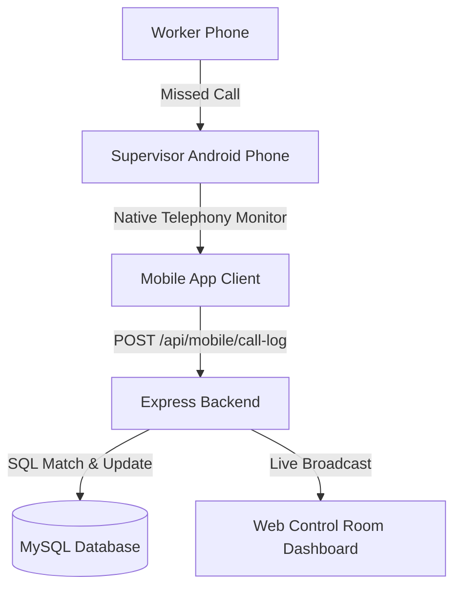

# CLE Call AP — Native Build & Running Guide

This guide contains the step-by-step instructions for building, installing, running, and demonstrating the native Android missed call telemetry features of the **CLE Call AP** application.

---

## 1. System Architecture Overview

The missed call logging feature uses native Android Telephony libraries to automatically scan call history and log attendance for registered workers.



### Running Modes
* **Live Mode (Development Build / Standalone APK)**: Uses `react-native-call-log` to read actual call history from the device. Requires the `READ_CALL_LOG` permission.
* **Simulation Mode (Expo Go fallback)**: If the app is run inside standard Expo Go, it automatically falls back to simulating a missed call from a random worker every 30 seconds for test purposes.

---

## 2. Running Local Development Servers

To run the application, you need to spin up the backend, frontend web app, and mobile packager on your computer.

### Step 1: Start the Backend API
1. Navigate to the backend folder:
   ```bash
   cd backend
   ```
2. Start the Express server:
   ```bash
   npm start
   ```
   *The server runs on `http://localhost:5000` (LAN: `http://0.0.0.0:5000`). It automatically initializes database schemas including the `mobile_call_logs` table.*

### Step 2: Start the Web Dashboard
1. Navigate to the frontend folder:
   ```bash
   cd frontend
   ```
2. Start the Vite development server:
   ```bash
   npm run dev
   ```
   *Open the web app in your browser at `http://localhost:5173`.*

### Step 3: Start the Mobile packager (Metro)
1. Navigate to the mobile folder:
   ```bash
   cd mobile
   ```
2. Start the Expo bundler:
   ```bash
   npm start
   ```
   *Keep this terminal open to feed the Javascript bundle to your phone over Wi-Fi.*

---

## 3. Building the Native Android APK

Since standard **Expo Go** cannot read hardware call logs, you must use a custom development build.

### Option A: Cloud Build via EAS (No Android SDK required on PC)
If you don't have Android Studio or the Android SDK installed on your PC, Expo can compile the APK for you in the cloud:

1. Install the EAS Command Line Interface globally:
   ```bash
   npm install -g eas-cli
   ```
2. Log in with your Expo developer account:
   ```bash
   npx eas login
   ```
3. Configure the EAS project (select `android`):
   ```bash
   npx eas build:configure
   ```
4. Build the development build APK:
   ```bash
   npx eas build --profile development --platform android
   ```
5. Once complete, EAS will output a QR code. Scan it on your phone or open the download link to install the **APK** on your phone.

### Option B: Local Compile (Requires Android SDK & adb)
If you have the Android SDK installed locally and a device connected via USB:
```bash
cd mobile
npx expo run:android
```

---

## 4. Connecting and Running on Physical Phone

Once the APK is installed on your phone, you need to link it to your PC's development packager.

### Step 1: Network Check
* Ensure your PC and phone are connected to the **exact same Wi-Fi network**.

### Step 2: Configure Debug Server
1. Launch the installed **CLE Call AP** app on your phone.
2. If it displays an "Unable to load script" red screen:
   * **Shake the phone** to trigger the React Native Developer Menu.
   * Tap **Settings**.
   * Under the *Debugging* section, tap **Debug server host & port for device**.
   * Type in your PC's local IP address and port `8081` (e.g. `172.20.10.2:8081`).
   * Tap **OK**, press the phone's back button, shake the phone again, and tap **Reload**.

### Step 3: Grant Permissions
* Upon successful load, log in as **Admin** (Username: `admin`, Password: `admin123`).
* The app will request permission to access your device's Call Log. Tap **Allow**.

---

## 5. Live Demonstration Scenario

To demonstrate this feature to an audience:

1. **Register a Test Number**:
   * Open the Web Dashboard (`http://localhost:5173`) in your browser.
   * Go to the **Workers** tab and click **Add Worker**.
   * Add a worker named `Test Worker` and input a real phone number you have access to (e.g., your personal second phone or a colleague's phone).
2. **Launch Mobile App**:
   * Open the app on your Vivo phone. Log in as `admin`.
   * Point out the **Auto Missed Call Monitor** widget showing **`LIVE`** status.
3. **Trigger Call**:
   * Use the test phone to dial your Vivo phone.
   * Let it ring for a few seconds and then hang up (or decline the call) to create a **Missed Call**.
4. **Demonstrate Telemetry Sync**:
   * Show the mobile screen: The missed call immediately appears at the top of the feed as **`NEW`** and matches `Test Worker`.
   * Show the Web Control Room page: Show that `Test Worker` has been automatically marked as **`Coming`** and the department shortages have dropped accordingly!
